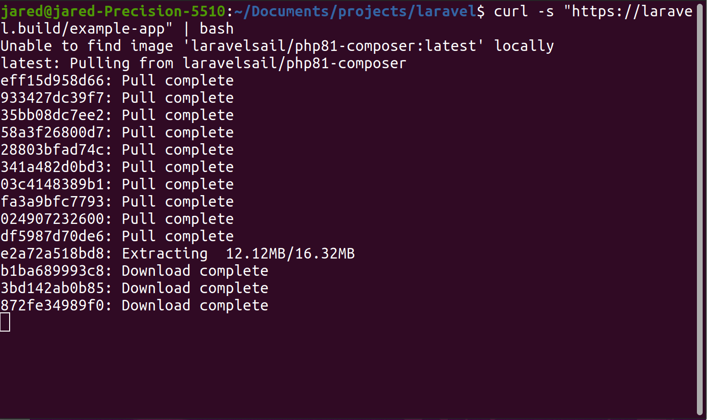
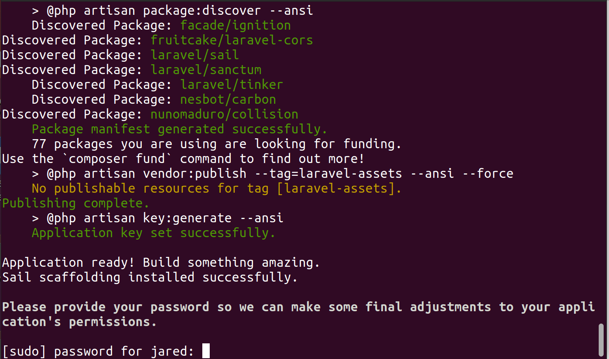
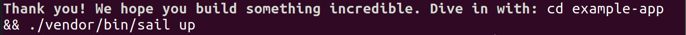
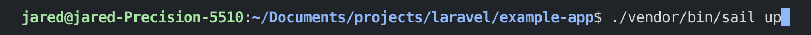
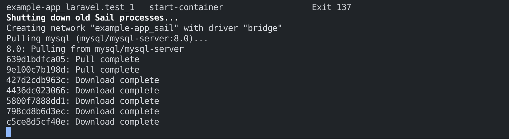

## An Introduction

Whether you're an experienced PHP developer, building apps from scratch, or your an absolute beginner and never heard of Laravel — this series is for you.

Laravel is what's known as a _web application framework_.  In other words, it does the heavy lifting for a web application so you don't have to build it yourself.  You can focus more time on prototyping or building your application.  There is a wealth of resources and documentation around Laravel, which is absolutely huge when you're starting out with any framework or language.

## In This Series
In this series, I will be walking through the architecture of a Laravel application, then develop a basic app.

## Installation
It's relatively straightforward to install Laravel (as of the time of writing, version 8) on all three major operating systems.  I would recommend checking out the [official installation guide](https://laravel.com/docs/8.x/) from Laravel themselves.  I will be using Ubuntu (a linux distribution) for this series, however the code is all the same no matter your platform of choice.

No matter the operating system you're using, it's recommended that you have Docker installed.  Docker makes it easy to run your Laravel project in a container.  Why is this useful?  With Docker, it's easy to develop your project with the same environment as your production environment.

You can download and install Docker from their "Get Started with Docker" page at [from docker.com](https://www.docker.com/get-started/).

## Starting Your First Project

### Using macOS
Once you have Laravel installed on macOS, it's super simple to start a new project.  All you have to do is run this command in the terminal

_curl -s "https://laravel.build/example-app" | bash_

_example-app_ can be changed to any name you like.  The directory for your new project will be created once you run the command.

### Using Windows
On Windows, you will need to install Windows Subsystem for Linux 2 (WSL2) if you haven't already.  WSL enables you to execute Linux binaries natively on Windows 10.  You can find Microsoft's documentation on installing WSL [here](https://docs.microsoft.com/en-us/windows/wsl/install-win10).

Once WSL is installed, you can type the following command to setup a new project:

_curl -s https://laravel.build/example-app | bash_

_example-app_ can be changed to any name you like.  The directory for your new project will be created once you run the command.

Once your project has been setup, you can use _Laravel Sail_ to build the application container.

Laravel Sail takes the complexity out of Laravel's docker configuration.  All you have to do is run the following commands:

_cd example-app_

_./vendor/bin/sail up_

When you run the _up_ command for the first time, Sail's application containers will take several minutes to build on your computer.  When you start Sail again once setup, it will be much quicker.

Once your application's Docker containers have started, you can access your application in your browser at [http://localhost](http://localhost).

### Using Linux
If you're using Linux, all you need to do is ensure that Docker is installed.  If it isn't already, you can visit the ["Get Started with Docker" page from docker.com](https://www.docker.com/get-started/).

To start a new Laravel application, run the following command:

_curl -s https://laravel.build/example-app | bash_

Feel free to change _example-app_ to any name you wish.  Once you run the command, your application's project directory will be created.

When you run the command, all of the Laravel files required for a project will download.

You may be prompted to enter your password at the end of the installation.  When prompted, enter your computer's account password, a few last items will be setup.

You will know when your project is setup once you receive the following message:

Once the project directory has been created, you can navigate to it and enable _Laravel Sail_.  Laravel Sail takes the complexity out of Laravel's docker configuration.

When you run the _up_ command for the first time, Sail's application containers will take several minutes to build on your computer.  When you start Sail again once setup, it will be much quicker.

Once your application's Docker containers have started, you can access your application in your browser at [http://localhost](http://localhost).

## Setting up an Alias for Sail
Instead of having to preface all Sail commands with _/vendor/bin/sail_, we can set up an alias of _sail_.  For this series, I'm going to assume that you have a _sail_ alias set up.

To set up an alias for Sail, type the following command:

_alias sail='[ -f sail ] && bash sail || bash vendor/bin/sail'_

Now you should be able to run _sail up_ instead of _/vendor/bin/sail up_.

## Your Development Environment
You will want to setup a proper development environment if you haven't already.  Myself, I enjoy using VSCode.  It's free and has convenient features such as an integrated terminal.  I would recommend using an editor that at least has syntax highlighting.  Syntax highlighting will make your development life a _lot_ easier.

## For More Information
For more information about why one might use Laravel and the Laravel installation process, please take a look at the [installation guide](https://laravel.com/docs/8.x) from Laravel themselves.

## In Conclusion
Laravel is a great option to build a PHP web application.  It's fast, reliable, and scalable.  It gets rid of the major painpoints of programming PHP applications from scratch.  In part three, I will be explaining the basic architecture of a Laravel application, which you can find [here](https://learn.yorkcs.com/posts/2022/laravel-nuts-and-bolts-2/).

