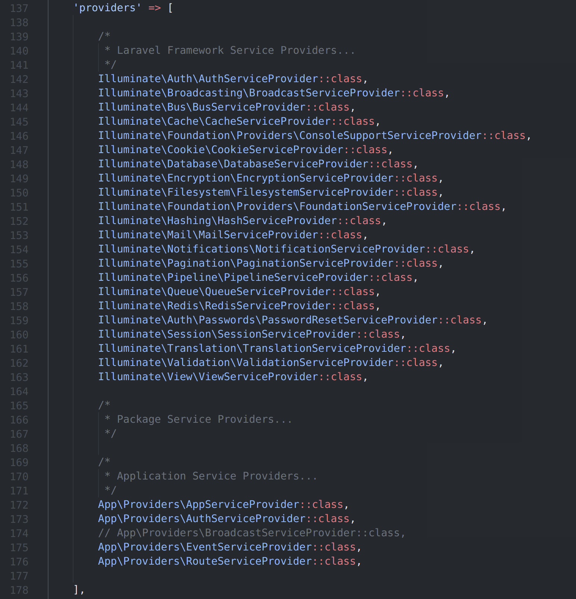

## An Introduction
At this point, you should have a starter application generated.  If not, please [revisit part one](https://learn.yorkcs.com/posts/2022/laravel-nuts-and-bolts-1/) where I cover how to setup a Laravel project.  I would recommend at least skimming this part of the guide.  There is some helpful background surrounding a Laravel project's directory structure that is important to understand.

## Artisan
You will hear me _a lot_ referring to _Artisan_.  Artisan is the command-line interface bundled with Laravel.  There are a lot of useful commands to help speed up the development process.

## Project Structure
Here is a list of the files and folders in your project's directory:



The first thing you will probably notice about a Laravel project's structure are folders in the main directory:
- _app_
- _bootstrap_
- _config_
- _database_
- _public_
- _resources_
- _routes_
- _storage_
- _tests_
- _vendor_

I'm going to briefly cover what each of these folders do, just so you have a reference later on.

### App Directory
The _app_ directory contains the code related to the core of your Laravel application.

There are several directories located inside the app directory by default:
- _Console_
- _Exceptions_
- _Http_
- _Models_
- _Providers_

#### Console Directory
The _Console_ directory contains the custom Artisan commands you've defined for your application.  Specifically, the console directory contains your _console kernel_.  Custom Artisan commands and schedule tasks are defined in the console kernel.

What is the console kernel?  The console kernel is used when you run commands relating to your application from the command line.  Using artisan, processing scheduled jobs, and processing queued jobs all are processed by the console kernel.

#### Exceptions Directory
The _Exceptions_ directory contains _Handler.php_, which is your application's exception handler.  If you wish to change exceptions are logged or displayed in your application, the _Handler_ class can be customized.

#### Http Directory
The _Http_ directory is where you would put  controllers, middleware, and form requests.  Nearly all _logic_ to handle requests to your application should be placed in this directory.

#### Models Directory
The _Models_ directory is where you put your [_Eloquent model classes_](https://laravel.com/docs/8.x/eloquent/).

What is an Eloquent model class?  Eloquent is an object-relational mapper, or ORM.  What does this mean?  Eloquent provides each database table a corresponding "Model" used to manipulate that table.  Eloquent models handle create, read, update, and delete (_CRUD_) operations as well.  All you need to know is that inserting, updating, and deleting entries from a table is made easy with Eloquent.

#### Providers Directory
The _Providers_ directory is where the [_service providers_](https://laravel.com/docs/8.x/providers/) for your application go.

What is a service provider?  Each of the core subsystems in your Laravel application are service providers.

By default when you create a new Laravel project, this directory will have several providers already.  More providers can be added to the providers directory as needed.

You can view all the service providers registered in your project in the _app.php_ file, located in the _config_ directory.

### Directories That Don't Exist by Default
There are several directories that don't exist in your project's root by default.

I will briefly cover what each of these directories do, for your future reference.

#### Broadcasting Directory
The _Broadcasting_ is where broadcast channel classes in your application go.

What is broadcasting in Laravel?  Very simply, it allows data to be transmitted via WebSockets between the server and the client.

You would use broadcasting if you want to send data in realtime betweeen the server and client.  Broadcasting takes place over channels.

When you create your first channel, this directory will be created.

#### Events Directory
The _Events_ directory contains all the event classes in your application.  Events are used for signaling to other areas of yoru application that an action has happened.  Events help to decouple your code.

Events can be created using the _event:generate_ and _make:event_ Artisan commands.

#### Jobs Directory
The _Jobs_ directory contains [queueable jobs](https://laravel.com/docs/8.x/queues) for your application.  In the current request lifecycle, jobs can be either queued by your application or execute synchronously.

Jobs can be created via the _make:job: Artisan command.  The jobs directory will be created when you create your first job.

It's worth noting that jobs that run synchronously in the current request are sometimes called "commands".

#### Listeners Directory
The _Listeners_ directory is the place for classes that handle [events](https://laravel.com/docs/8.x/events) in your application.  Event listeners perform a function in response to an event being fired.

As an example, you could handle a _PasswordReset_ event with a _SendPasswordResetEmail_ listener.

### Bootstrap Directory
The _bootstrap_ directory contains the _app.php_ file.  This file loads the framework.  It's worth noting that this directory contains a _cache_ directory used for caching framework files.  Caching these framework files allow Laravel to be more performant.  There generally isn't a need to edit or add anything to the bootstrap directory.

### Config Directory
The _config_ directory contains all of the files related to your application's configuration.

### Database Directory
The _database_ directory contains the database migrations, model factories, and seeds that you write.  For those using SQLite, this is the directory where SQLite databases can be stored.

### Public Directory
The _public_ directory includes all of the files that can be served to a user.  Specifically, this directory houses the _index.php_ file.  The index file is the entry point for requests to your application and it also configures autoloading.  This is also where your publicly accessible assets like images, CSS, and JavaScript are stored.

### Resources Directory
The _resources_ directory contain the views of your application.  This directory also contains your un-compiled CSS or JavaScript assets, as well as your language files.

### Routes Directory
The _routes_ directory is used for defining routes for your application.  There are a few route files included with Laravel by default:
- _web.php_
- _api.php_
- _console.php_
- _channels.php_

I will briefly describe the purpose for each of these route files:

#### _web.php_
The _web.php_ file contains routes that Laravel adds to the _web_ middleware group (think of it like a category).  Specifically, routes that provide session state, CSRF protection, and cookie encryption are automatically placed here.  It is also (in most cases) where you will define all of the routes for your application.

#### _api.php_
The _api.php_ file contains routes that Laravel adds to the _api_ middleware group.  Specifically, these routes are supposed to be stateless.  This means that requests sent to the application through these routes are expected to be authenticated via tokens and will be defined access to session state.

### Storage Directory
The _storage_ directory contains the following:
- Blade templates (used in your application's views)
- file based sessions
- file caches
- miscellaneous files generated by your application

Inside the storage directory are three other directories.  Each directory is for storing files for a specific purpose.

#### App Directory
The first directory in the storage directory is the _app_ directory.  Any files generated by your application can be stored in the _app_ directory.

#### Framework Directory
The second directory in the storage directory is the _framework_ diretory.  Files stored in the app directory are files and caches generated by the framework.

#### Logs Directory
The third and final directory in the storage directory is the _logs_ directory.  The logs directory stores any logs generated by your application.

#### Storing User-Generated Files
User-generated files can be stored in the _storage/app/public_ directory.  Here are a few examples of user-generated files one might have stored in the _storage/app/public_ directory:
- profile pictures
- publicly available photos that users upload
- publicly available documents that users upload
- etc.

You may be thinking, _what's the difference between storing user-generated files in the public directory vs. storing them in the storage/app/public directory?_

Files and assets that are intended to be accessed by your application's users should be accessed through the _public_ directory.  This means that if you store files in the _storage/app/public_ directory, you will need to createa  symbolic link at _public/storage_ that points to the _storage/app/public_ directory.

To create this symbolic link, execute the following command:

_sail artisan storage:link_

Now, files (and only files) in the public storage directory are available through the _public_ folder via the _public/storage_ path.  It's a beautiful thing.

### Tests Directory
The _tests_ directory is used to store any automated tests that you write.  Each test class you write should be suffixed with the word _Test_.  For example, if you have (this is vague) a test named "Calculation", you would append "Test" to the end of the class name.  So, the class name would now be "CalculationTest".

Tests can be ran with _phpunit_ or via the _php vendor/bin/phpunit_ commands.  You can also run the _sail artisan test_ Artisan command for a more in-depth and visual and display of your test results.

### Vendor Directory
Like most PHP applications, Laravel uses [Composer](https://getcomposer.org/) as it's dependency manager.  The _vendor_ application contains Composer dependencies.

## Running Your Project
Since Laravel Applications run on a web server, Laravel has it's own built-in server for development.  To start the server, type:

> _sail up_

Laravel Sail will start and handle everything related to Docker for you.  It's super easy and convenient.

## In Conclusion
In the next part of this series, we will be diving into building a simple application, a notes app.  You can find part four of _Laravel Nuts and Bolts_ [here](https://learn.yorkcs.com/posts/2022/laravel-nuts-and-bolts-4/). 

