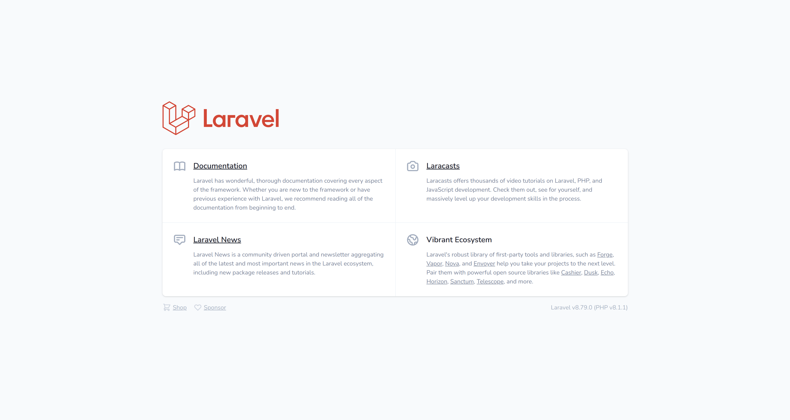
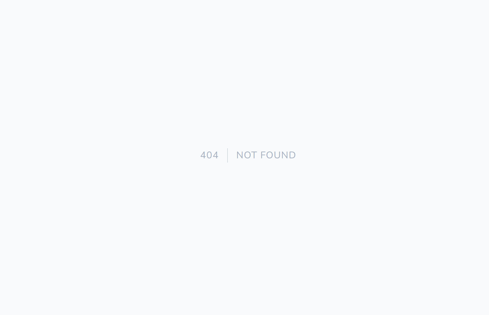
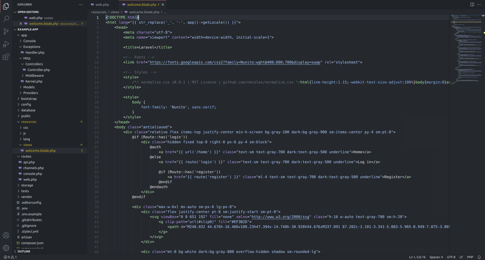
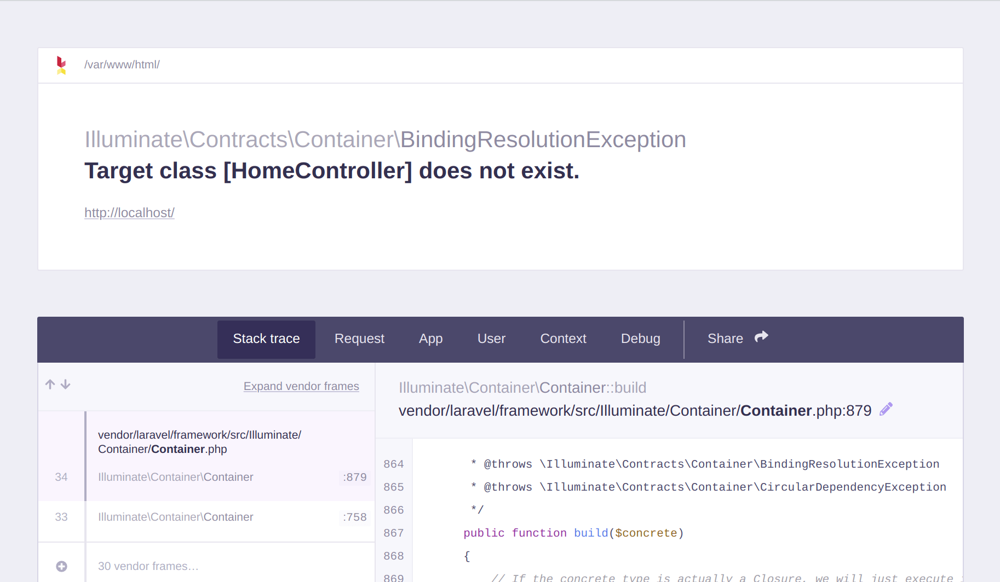
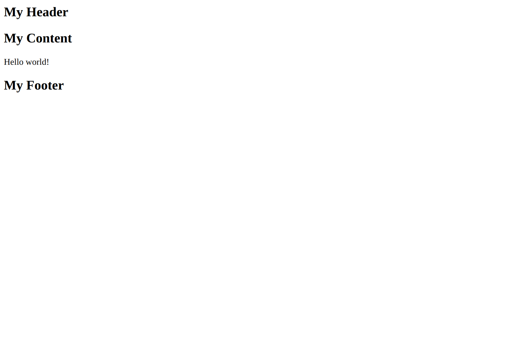

## An Introduction
In this part of _Laravel Nuts and Bolts_, we will be writing the code of our Laravel application.  What will be making?  A sticky note application.  An application like this can be useful in keeping track of tasks throughout your day, for example.

If you haven't created a Laravel project yet for this series, please [head over to the previous part](http://localhost:1313/posts/2022/laravel-nuts-and-bolts-3/), where I provide an overview of a Laravel application.  You will need a project set up before continuing.

If you're coming back to this tutorial, here is a table of contents to jump back to the spot you were at.

### Table of Contents
1. [Brief Overview of Routes](#brief-overview-of-routes)
2. [Views](#views)
3. [Plan for Our App Views](#plan-for-our-app-views)
4. [Creating a Homepage Controller](#creating-a-homepage-controller)
5. [Blade Templates](#blade-templates)
6. [Components](#components)
    1. [Class-Based Components](#class-based-components)
    2. [Anonymous Components](#anonymous-components)
7. [Creating a Page Header](#creating-a-page-header)
8. [Creating a Page Footer](#creating-a-page-footer)
9. [Creating the Layout Component](#creating-the-layout-component)
10. [Creating a Homepage Template](#creating-a-homepage-template)
11. [Creating a Model for Notes](#creating-a-model-for-notes)
12. [Application Styling](#application-styling)
13. [In Conclusion](#in-conclusion)

## Before Continuing
Please make sure Sail is running by executing:
> _sail up_

This will start Sail.  Once sail has is running, you will be able to add _sail_ before your Artisan commands.

## Brief Overview of Routes
In order for users to access your application through their web browser, you need what is known as a _route_.  By default, Laravel creates a route by default.  Open the _web.php_ file in the _routes_ directory of your project.

You should see the following code:


Route::get('/', function () {
    return view('welcome');
});


This is a route definition.  If you run `sail up` to start your server, then navigate to `http://localhost`, you should see the following page:

Try changing the `'/'` string to `'/hello/world'`.  Your code should now look like so:


Route::get('/hello/world', function () {
    return view('welcome');
});


Then, try refreshing the page.

A `Not Found` page will be displayed since we are now displaying the view at a different location.

Try navigating to: `http://localhost/hello/world`

You will now see the default page again!

Let's change the path back so the default page is accessible at `http://localhost`.  The code should appear as follows again:


Route::get('/', function () {
    return view('welcome');
});


## Views
Views are what are rendered to the user.  The files representing views can be found in the `resources/views` directory.  By default, you should see a `welcome.blade.php` file.  Try opening the file and take a look around.

You might notice this is the code for the default page you see at `http://localhost`!

Keep views tucked into the back of your mind.  We will be creating one soon.

## Plan for Our App Views
We are going to be creating `two` views for our app: a homepage, and a manage sticky note page.

The homepage is going to show a few statistics such as the number of sticky notes currently active, and the total number of sticky notes ever created.

The sitcky note management view will allow us to create, edit, and remove sticky notes.

Instead of writing the code twice to define the basic layout of both pages, we will be writing a `component` for our layout.  I will be covering components and why they're useful when we get there.

We are going to start by creating the homepage view.

## Creating a Homepage Controller
The `web.php` can become cluttered over time as you start to add more routes.  In larger projects, it can become easier for your route code to become organized.  One step you can take to help mitigate this is by creating controllers for your views.  It's best to learn these best practices now, along the way and not down the road.

Remember, controllers can be used for directing the user to views.

Let's start by creating a controller for our homepage view.  Make sure you have a terminal open, or use the integrated terminal in your code editor, then type:

> _sail artisan make:controller HomeController_

You should see a notice that the controller was created successfully.



If this command fails and alerts you that your PHP version is out of date, please lookup how to install PHP 8.1 (at the time of this writing, it should say the minimum PHP version required) for the platform you're using.

Let's edit our new controller class by adding some code to make it direct the user to our future home view.

You should see the following code in the file already:

<?php

namespace App\Http\Controllers;

use Illuminate\Http\Request;

class HomeController extends Controller
{
    //

}


Under the double-slashes between the curly braces, let's start by adding a `public` function called `index`.


public function index() {

}


You might remember that the `web.php` file contains a call to the `view` function in the following route definition:


Route::get('/', function() {
    return view('welcome');
});


We are going to take the following line:
> return view('welcome');

and add it to our new `index` method in the `HomeController` class.  The `index` method should now look like this:


public function index() {
    return view('welcome');
}


We will need to change name of the view, `welcome` to our `home` view:


return view('home');


The entire `HomeController.php` file should look like this:

<?php

namespace App\Http\Controllers;

use Illuminate\Http\Request;

class HomeController extends Controller
{
    //

    public function index() {
        return view('home');
    }
}


Now, remove the anonymous function (the `function() { }`) from the route definition in our `web.php` file.  The route definition should now look like the following:


Route::get('/', );


As the second argument of the `get` method call, add the following:


[HomeController::class, 'index']


What we just typed is an array (the square brackets are one way to declare an array), with the first element being a `HomeController` class reference, and the second element being the name of the method of our `HomeController` class we created, `index`.  To put it simply, the first argument is the class, and the second is the method in the class.

What we are doing with this line is instructing Laravel to look at the `index` method of the `HomeController` class to see where to route the user visiting `http://localhost`.

The completed `Route::get` method call should now look like:

Route::get('/', [HomeController::class, 'index']);


If you were to navigate to `http://localhost` right now, you will see the following error:

You will need to import the `HomeController` class into your `web.php` file.

Under this line:

use Illuminate\Support\Facades\Route;


Add the following `use` statement:


use App\Http\Controllers\HomeController;


If you were to navigate to `http://localhost` again, you still won't see anything.  This is because we need to create a view for our homepage.

We can now create the view for the homepage.

## Blade Templates
Laravel has it's own templating engine, known as _Blade_.  Blade templates are not plan PHP.  Blade contains a lot of convenient shortcuts that are compiled into PHP and are cached until changed.  Since Blade templates are cached after they're compiled, your application should take almost no hit in performance.

To give a brief overview to the syntax of Blade templates, open the `welcome.blade.php` file, located in the `resources/views` directory.

If you're familiar with the PHP syntax already, take a look at some of the attributes.  



You may notice the addition of double curly braces.  Can you guess what they do?

They are shorthand for echoing a line.

So, let's say you have the following line:


<?php echo $amount_pizzas; ?>


With Blade, you can shorten this to:


{{ $amount_pizzas }}


You can write conditional statements similar to how you would in plain PHP.  All you have to do is add a `@` before the statement.

For example, if you write the following in plain PHP:


if ( $amount_pizzas > 10 ) {
    echo 'That is a lot of pizzas!';
}
else {
    echo 'Bake more pizzas.';
}


You would write this with Blade like so:


@if ( $amount_pizzas > 10 )
{{ 'That is a lot of pizzas!' }}
@else
{{ 'Bake more pizzas.' }}
@endif


In the real world, a more practical example would be outputting an array for debugging purposes.  If you wanted to output the results of an array in a more readable way, you could write the following with plain PHP:


<?php echo '<pre>' . var_export( $my_results, true ) . '</pre>'; ?>


With Blade, you can skip using the PHP opening and closing tags and the use of _echo_ like so:


<pre>{{ var_export( $my_results, true ) }}</pre>


With Blade, you can also create loops, such as `foreach`, by also including `@` in front of it.  Let's say you wanted to output the title and description of each result in an array.  This is how you would write it:


@foreach ( $my_results as $result )
    
{{ $result->title }}

    
{{ $result->description }}

@endforeach


If you wanted to write plain PHP in a Blade template, you can use the `@php` declaration:


@php
$say = 'hello';

echo $say; // This is regular old PHP!
@endphp


This overview of Blade provides you everything you need to know for writing the rest of our application.  We will be writing Blade templates very soon.

## Components
Components are the recommended way to reuse parts in your layouts.  When created with the following Artisan command, a component class is generated, and a Blade template is generated for the component.

There are two types of components: class-based components and anonymous components.

### Class-Based Components
Class-based components have a class to go along with their Blade file.

### Anonymous Components
Anonymous components do not have a class file and only have a Blade file.

## Creating a Page Header
Let's create a component for our homepage as follows:

>_sail artisan make:component Header_

After you run this command, a new file named `header.blade.php` will be created in `resources/views/components`.  Since there have been no previous components, a `components` directory will be created inside your `views` directory.

Another file named `Header.php` will be generated in the `app/View/Components` directory.  Delete this file since our page header is going to be an anonymous component.

Open up the `header.blade.php` file and you will see the following code:


    <!-- Knowing is not enough; we must apply. Being willing is not enough; we must do. - Leonardo da Vinci -->



Inside the file is a pair of HTML `
` tags.  If you're not sure what an HTML tag is, or what HTML is, I would highly recommend taking a pause from this tutorial and skimming my ["Nibble of HTML"](http://learn.yorkcs.com/2019/06/22/a-nibble-of-html/) tutorial.  Otherwise, let's continue on!

Let's edit this header component.

All I'm going to erase everything in this file and write the following markup:

<header>
    <h2>My Header</h2>

    <nav>
        <a href="/">Home</a>
        <a href="/notes">Notes</a>
    </nav>
</header>


## Creating a Page Footer
While we're add it, let's create a component to represent the footer.

> _sail artisan make:component Footer_

A new file called `footer.blade.php` will be added to the `resources/views/components` directory.

Much like our header component, a component class was created in the `Footer.php` file, located in the `app/View/Components` directory.  Our footer component will also be anonymous, so delete this `Footer.php` class file.

Open the `footer.blade.php` file, clear the existing code in it, then add the following markup:


<footer>
    <h2>My Footer</h2>
    <small>This is some more footer information.</small>
</footer>


## Creating the Layout Component
We will be creating a layout component to serve as the "master" template for our layouts.  Our homepage and sticky note management page will be templates that are inserted where we want in our master layout.

Component Blade files are stored in the `resources/views/components` directory.

Component class files (for class-based components) are stored in the `app/View/Components` directory.

Before we use this layout component, we first have to create it.  There is an Artisan command we can use for creating a component.  In your command line, type:

> sail artisan make:component Layout

If you look in the `app/View/Components` directory, you may notice that a file called `Layout.php` is in there.  Our layout component will be an anonymous component, so you can delete this file.  The reason why the layout component should be anonymous is because it will not need to contain any additional logic.

At this point, we will need to define the HTML for our layout component.  All pages in our application will use this HTML.  Please open the `resources/views/components/layout.blade.php` file.

The first thing we are going to do is add the declaration for an HTML file.

> <!DOCTYPE html>

Under the HTML doctype declaration, let's add a pair of `<html>` tags.


<html>

</html>


Between the &lt;html&gt; tags, add a opening and closing `<head>` and `<body>` tags.  Your code should now look like this:

<!DOCTYPE html>
<html>
    <head>

    </head>

    <body>

    </body>
</html>


It's a good practice to set the language of your pages.  In the opening &lt;html&gt; tag, add the following attribute:

> lang="{{ str_replace('_', '-', app()->getLocale()) }}"

Laravel will automatically fill in the locale of your app in a formatted string recognized in HTML.

The full opening &lt;html&gt; should now look like so:


<html lang="{{ str_replace('_', '-', app()->getLocale()) }}">


Next, there are a few tags we should define between the &lt;head&gt; tags.

First, let's add a `<meta>` tag for defining the character encoding of our page.  Write the following line:


<meta charset="utf-8">


Next, write the following line to set the viewport to help make our pages responsive on mobile:


<meta name="viewport" content="width=device-width, initial-scale=1">


Finally, we can add a pair of `<title>` tags to set the title of our page.


<title>Example App</title>


The full HTML in our `layout.blade.php` file should look as follows at this point:


<!DOCTYPE html>
<html lang="{{ str_replace('_', '-', app()->getLocale()) }}">
    <head>
        <meta charset="utf-8">
        <meta name="viewport" content="width=device-width, initial-scale=1">
        
        <title>Example App</title>
    </head>

    <body>
    </body>
</html>


It's time to define where we want parts of our layout.  Laravel makes it easy to define where we want components to be rendered.

The basic syntax to add a component to a Blade template or component is:
> &lt;x-**component name** /&gt;

To see this in action, write the following line between the &lt;body&gt; tags:


<x-header/>


This will inject the header template we made into our layout that our pages will use.

Next, we will define where we want the content from our page Blade templates to go.  This is where _slots_ come into play.

With components, you can define a slot where content will be injected.

In our case, we will want content from our two pages to be injected under the header, but before the footer.

The define where we want our content to be injected, we will need to output the content of the `$slot` variable.

Add this line under our header component definition:


{{ $slot }}


Content will now be injected under the header.  The next step is to define where the footer will be.  Since we want the footer under our page content, add the following tag to inject our component:


<x-footer/>


## Creating a Homepage Template
Let's create a new Blade template for our homepage.  In `resources/views`, create a file and name it `home.blade.php`.

Laravel uses what's known as _Blade templates_ for defining views.  Blade makes creating views in your application easy.

Blade templates are defined in the `resources/views` directory.

I do want to mention again that the `resources` directory is for "raw" files and assets that have not been compiled yet.  One of the great things about Blade templates is that you can include components within your templates, and Laravel does the work of combining everything into a single PHP file to serve.  Compiled views are copied to the `public` directory.

If you navigate to `http://localhost` in your browser, you should see the current homepage view display:

Laravel was able to pull in the components we wrote and include them in the homepage.  It's a beautiful thing.

## Creating a Model for Notes
The idea of this series is to create a sticky notes app.  The problem we have now, is that we actually need to be able to create sticky notes.  We can't create sticky notes if Laravel doesn't have any concept of what a sticky note is.  This is where models come into play.

We can define a sticky note with an Eloquent _model_.  Remember, the purpose of Eloquent is to make working with database tables with Laravel easy.

Remember that the purpose of models is to control the data that controllers can access.

Like most things in Laravel, there is an Artisan command to make it.  Let's create a model to define a sticky note with the following command:

> sail artisan make:model StickyNote

When we run this command, a class named `StickyNote` will be created in a new file called `StickyNote.php`, located in the `app/Models` directory.

If you open up the `StickyNote.php` file, you will find that there isn't much code in it.


namespace App\Models;

use Illuminate\Database\Eloquent\Factories\HasFactory;
use Illuminate\Database\Eloquent\Model;

class StickyNote extends Model
{
    use HasFactory;
}


By default, we don't need to specify a name for the database table that will be associated to our sticky notes.  Unless there's another name specified, Laravel will use the "snake case" version of your model's class name as the database table name.

For future reference, if you did want to specifiy a different name for the database table, you can add the following property to your model class:


protected $table = 'my_table_name';


Laravel would then take the custom table name from this protected property.

There are a things to keep in mind regarding how Eloquent works with database tables:
- By default, Eloquent will make the assumption that each model's database table will have an `id` column, which will be the primary key.  If you want to change the column that is the primary key, you can add a protected `$primaryKey` property assigned to the new column name.
- Eloquent will also make the primary key column auto-increment by default.  If you want to turn off auto-incrementing for the primary key column, you will need to define a public property, `$incrementing`, and set it to `false`.
- If you change a primary key column so it's data type is no longer an integer, you should add a protected property, `$keyType` to a string named the new data type.
- By default, Eloquent will assume you want a `created_at` and `updated_at` column in your database table.  Each of these values will be automatically set when the model is created or updated.  If you don't want Eloquent to use these columns, you can add a public `$timestamps` property to your model's class and set it to `false`.

There are a lot of options when it comes to how you can tell Eloquent to manage database tables.  You can read about everything related to Eloquent in the [official documentation](https://laravel.com/docs/8.x/eloquent/).

### Creating Database Tables with _Migrations_
Laravel provides an easy way to set up database tables.  We can create what's known as a _migration_ to make it easy for ourselves and other developers to setup the database tables in our application.

Let's create a migration to setup a database table for our sticky notes.

> sail artisan make:migration create_sticky_notes_table

You should now see a success notice.



Once your migration has been created, we can go in and edit the schema for our sticky note's database table.  You can edit the database schema in the migration file for our sticky notes.  A new file named `####_##_##_######_create_bears_table.php` will be generated in the `app/database/migations` directory.  Open this file.  You should see the following code:

<?php

use Illuminate\Database\Migrations\Migration;
use Illuminate\Database\Schema\Blueprint;
use Illuminate\Support\Facades\Schema;

class CreateStickyNotesTable extends Migration
{
    /**
     * Run the migrations.
     *
     * @return void
     */
    public function up()
    {
        Schema::create('sticky_notes', function (Blueprint $table) {
            $table->id();
            $table->timestamps();
        });
    }

    /**
     * Reverse the migrations.
     *
     * @return void
     */
    public function down()
    {
        Schema::dropIfExists('sticky_notes');
    }
}


There are two methods automatically generated in this database table class when you use Artisan to create a migration: `up`, and `down`.

The `up` method is used to run the migrations associated with the table.  The `down` method is used to reverse the migrations associated with the table.

In the case of our sticky notes table, when the migrations are run, a new table named `sticky_notes` is created.  The table will have an `id` column, as well as timestamp columns (`created_at` and `updated_at`).  There is an additional column we will want to define: `body`.

Create some new lines between these two lines:

$table->id();
$table->timestamps();


Once you have made some space, write the following line to add a `body` column.


$table->text('body');


Since Laravel creates the table in the `up` method, it also drops (deletes), the table (if it exists), in the `down` method.

To run our migration, execute the following in the command line:
> _sail artisan migrate_

Our `sticky_notes` database table is now created!

You can check by running:

> _sail mysql_

It might take a few seconds, but the MySQL terminal will appear.  If you type `SHOW TABLES;`, you should see our new `sticky_notes` table among the tables listed.



## Creating a Note Management Template
Now that we have a model for our sticky notes, we can create a new Blade template for managing notes.  In the `resources/views` directory, add a new file called, `notes.blade.php`.

Like the home template, we will want to encapsulate the page content in a pair of layout component tags.

Start with the opening layout component tag:


<x-layout>


Then, make some line breaks to provide some space.  Finally, add the closing layout component tag:


</x-layout>


Your code should now look something like this:


<x-layout>

</x-layout>


Inside these layout component tags, let's add a pair of `<main>` tags.


<x-layout>
    <main>
        
    </main>
</x-layout>


Between the `<main>` tags, let's add a heading for our page:


<h1>Manage Sticky Notes</h1>


Next, let's add a form to enable us to publish new sticky notes.

To create the form, start out with a pair of `<form>` tags like so:


<form method="POST" action="/admin/notes" enctype="multipart/form-data">

</form>


This next line is very important.  Every form you create with Laravel should have this line in almost every case.  This is the line:


@csrf


The purpose of this line is to prevent _cross-site scripting_ (XSS) attacks.  The `@csrf` declaration creates a hidden input with a token.  When you go to submit the form, the server will check that the token that was sent matches the token it generated.  This ensures that the form was not submitted from your application's actual page and _not_ from another website or application.

Let's add this line inside our `form` element like so:


<form method="POST" action="/admin/notes">
    @csrf
</form>


Next, we can add a field to type content for a sticky note.  This will be a textarea component named `body`.

Now, we could just use a set of `<textarea>` tags.  However, the beautiful things about Blade is that we can define components.  Let's say we wanted to add a CSS class to all textareas.  Instead of adding a `class` attribute to every textarea, we can create a `Textarea` component that can be rendered each time with a `class` attribute we define once.

Let's run the following command:

> _sail artisan make:component Form.Textarea_

This will create a Blade file in the `resources/views` directory, and a controller class in `app/Http/Controllers` named `Textarea`.  Delete the controller class as, like our other components, this component is going to be an anonymous component.  You may notice that in our Artisan command that we prefixed the component name, _Textarea_, with _Form_.

It's worth noting that you can organize controllers into folders by defining a path.  Each part of the component path you define in your Artisan command should be separated with a period (.).

After the `@csrf` line, type:


<x-form.textarea name="body" required></x-form.textarea>


Since we don't want to add any text into the textarea by default, we will not add anything between the opening and closing tag.  We can add the attribute, `required`, to add client-side validation via the browser.

The only other input that needs to be added to this form is a submit button, to publish new notes.

Like our textarea component, we can create a component for our button element.  Type the following Artisan command:

> _sail artisan make:component Form.Button_

Inside the button component Blade file, add the following code:


<x-form.field>
    <button type="submit">
        {{ $slot }}
    </button>
</x-form.field>


Now we can inject our new button component into our form:


<x-form.button>Publish Note</x-form.button>


At this point we are finished with the form to create sticky notes.

The next section to add to our note management template for displaying the sticky notes themselves.

If you've taken a look at _Laravel Nuts and Bolts_ part 3, you will know that you can use conditional statements and loops in Blade templates.  This is where we can put them into practice.

After the ending `<form>` tag, let's add a heading to define the next area of our template:


<h3>Your Sticky Notes</h3>


Next, we want to display a wrapper `
` displaying all of our sticky notes _if_ sticky notes exist.  If sticky notes don't exist, then we will display a notice that there are no sticky notes.

Let's start a foreach loop after this heading.


@if (count($stickyNotes) > 0)


Inside this `if` statement, we want to render a `
` element that will contain our sticky notes.





Inside this set of `
` tags, we can add the following `foreach` loop to iterate through the stored sticky notes.


@foreach ($stickyNotes as $stickyNote)

@endforeach


Inside this `foreach` loop, let's add another set of `
` tags to represent an individual sticky note.





The plan is for every sticky note to have a header, containing a delete button and edit link.  Then, the `created_at` and `modified_at` times will be displayed (in UTC).  Note, if you stick with this series until the end, I will be covering how to display these times in the user's timezone.  I can't cover this now, because authentication is required for user accounts.  We would be storing the timezone for each user.  After displaying the times, the body of the note will be displayed.

Inside this latest set of `
` tags, let's add a header element.


<header>

</header>


We will be adding a delete button and an edit link between these `<header>` tags.  Let's start by adding a delete button.  The idea is that this delete button will send a request to delete the particular sticky note we clicked the delete button for.

Let's add the form for this delete button.  Start by adding the following `<form>` tags.  Do note the change in the `action` attribute.  We are echoing in the `id` of the sticky note in the current iteration of the foreach loop.


<form method="POST" action="/admin/notes/{{$stickyNote->id }}">

</form>


For example, if a sticky note has an `id` of 7, the action will be set as follows:

> _/admin/notes/7_

This will be used to tell Laravel which sticky note we want to delete.

We will once again add a CSRF token hidden input like so:


@csrf


The following denotation will tell Laravel which method we actually want to process the request as.  In this case, we want to use the `delete` method.


@method('DELETE')


Finally, we can add the button to submit our delete form.  Since we already created a button component, we can reuse it like so.


<x-form.button>Delete</x-form.button>


We are now finished with our delete button and respective form.

The last thing to add between our `<header>` tags of the sticky notes is an edit link.


<a href="/notes/{{ $stickyNote->id }}">Edit</a>


The sticky note `id` of the current foreach iteration will be echoed after the `/notes/` path.  We will utilize this `id` to display the edit form to edit that sticky particular sticky note.

At this point, we are finished with the header of a sticky note.  Your sticky note header code should look like this:


<header>
    <form method="POST" action="/admin/notes/{{ $stickyNote->id }}">
        @csrf
        @method('DELETE')

        <x-form.button>Delete</x-form.button>
    </form>

    <a href="/notes/{{ $stickyNote->id }}">Edit</a>
</header>


Next, we will display the `created_at` and `modified_at` times.  Like I said, these times will be displayed in UTC to start with.

After the `<header>` tags, add a pair of `<small>` tags.


<small>

</small>


Inside these small tags, write the following code:


Created at: {{ $stickyNote->created_at->format('m/d/y g:ia') . ' UTC' }}
 
Modified at: {{ $stickyNote->updated_at->format('m/d/y g:ia') . ' UTC' }}


Finally, we can finish rendering an individual sticky note with the following code.  We can encapsulate the `body` of a sticky note with a pair of `
` paragraph tags.  We can retrieve the `body` property of the `StickyNote` by just accessing it like any regular PHP object property.



{{ $stickyNote->body }}



We are now finished with defining the markup for individual sticky notes.  After the closing sticky note `
` tag, we will need to end our foreach loop with the following Blade denotation:


@endforeach


After the closing tag for the sticky notes wrapper, add an `else` denotation like so:


@else


Then, let's add a notice for when no sticky notes exist.



No sticky notes have been added yet.



Finally, we can finish all of this off by defining the end of our `if` statement.


@endif


At this point, the code for our `notes.blade.php` file should like something like this:


<x-layout>
    <main>
        <h1>Manage Sticky Notes</h1>

        <form method="POST" action="/admin/notes" enctype="multipart/form-data">
            @csrf
            
            <x-form.textarea name="body" required></x-form.textarea>

            <x-form.button>Publish Note</x-form.button>
        </form>

        <h3>Your Sticky Notes</h3>
        @if (count( $stickyNotes ) > 0)
            

                @foreach ( $stickyNotes as $stickyNote )
                    

                        <header class="sticky-note-header">
                            <form method="POST" action="/admin/notes/{{ $stickyNote->id }}">
                                @csrf
                                @method('DELETE')

                                <x-form.button>Delete</x-form.button>
                            </form>

                            <a href="/notes/{{ $stickyNote->id }}">Edit</a>
                        </header>

                        <small>
                            Created at: {{ $stickyNote->created_at->format('m/d/y g:ia') . ' UTC' }}
                             
                            Modified at: {{ $stickyNote->updated_at->format('m/d/y g:ia') . ' UTC' }}
                        </small>

                        
{{ $stickyNote->body }}

                    

                @endforeach
            

        @else
            
No sticky notes have been added yet.

        @endif
    </main>
</x-layout>


## Application Styling
The last thing to do in this series is make our app look better.  Right now it looks quite bland.  If you're interested in how to style your application, I will be covering it in the next part.  If you're interested in learning how to use one of the [popular CSS frameworks](https://dev.to/theme_selection/best-css-frameworks-in-2020-1jjh), I will be covering how to style this application with the top four frameworks in the article I just linked.

## In Conclusion
Hopefully you have found this series useful.  I would love to hear your feedback.  Do you want to see more Laravel tutorial series?  You can send feedback about this series to my company [contact form](https://yorkcs.com/contact/).

