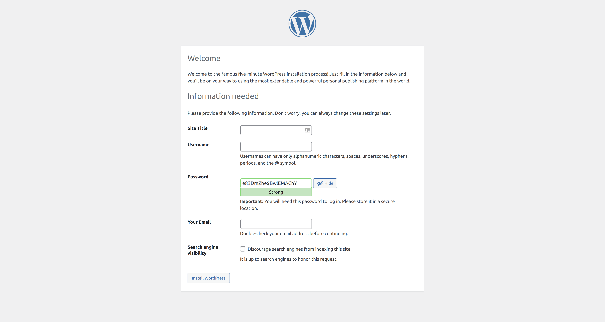

## Downloading WordPress
One of the beautiful things about WordPress is that it's free — in more than one way.

### Four Freedoms
Before we continue, I want to touch on what's known as the four freedoms that WordPress provides.  Here they are:
> The 1st freedom: To run the program for any purpose.
>
> The 2nd freedom: To study how the program works and change it to make it do what you wish.
>
> The 3rd freedom: To redistribute.
>
> The 4th freedom: To distribute copies of your modified versions to others.

Now let's go download this amazing piece of free software.

### WordPress.org vs WordPress.com
It's important that there are two "types" of WordPress.  WordPress can be found at [WordPress.org](https://wordpress.org/) and [WordPress.com](https://wordpress.com/).  What is the difference, you ask?  WordPress.org is the self-hosted version of WordPress.  You can install WordPress from WordPress.org anywhere you like, such as the hosting provider you picked out.  WordPress.com is a more limited version of WordPress that Automattic themselves host.  In this guide, we will only be focused on WordPress.org — the version where you have total control.

Navigate to WordPress.org, then click the blue _Get WordPress_ button at the top-right corner of the page.

Once you arrive at the Get WordPress page, scroll down until you see the Download WordPress button.  At the time of writing this, the latest version is 5.8.3.  I will update this guide once WordPress 5.9 is released.  I will be using the WordPress 5.9 release candidate later in this guide when we start designing pages.  The process will be the same once WordPress 5.9 is actually released on January 25.

## Uploading WordPress to Your Hosting Environment
Most hosting providers provide the ability to upload files via FTP or SFTP.  It is important that you do not use your host's File Manager for uploading WordPress files.  It's likely not going to work well at all.  You will want to use FTP or SFTP.  FTP stands for File Transfer Protocol, and SFTP stands for Secure File Transfer Protocol.  You will need a client application such as FileZilla (my personal favorite) in order to use these protocols.

Please lookup how to use FTP/SFTP with the hosting provider you're using.  If your host gives you the choice between the two, use SFTP so the connection is encrypted.

At this point, I'm going to assume that you're connected to your website with your FTP client.  Make sure you entered the public directory.  If you don't know what that is or how to get to it, please look it up for your specific hosting provider.

In most FTP clients, you should be able to enter the WordPress directory you extracted, select all the files, and upload them to the hosted public directory.

## Installing WordPress
Once the files are uploaded, navigate to _your domain name_ in your browser.  The WordPress installer will appear.

The first step is to select your language.  Once you select it, click the blue _Continue_ button.

Once you click _Continue_, you will see a notice that you should have your database credentials handy for the next step.  Remember the database credentials I had you write down?  This is where you will need that information.  Once you have your credentials on hand, click the _Let's go!_ button.

You will be brought to a screen where you will enter your _database name_, _username_, _password_, _database host_, and _table prefix_.  Feel free to leave the table prefix as default.

Once you've entered your database credentials, click the _Submit_ button.

If WordPress connects to the database successfully, you will see the following screen.  If you see this screen, click the _Run the installation_ button.

WordPress needs a little more information before WordPress can install.  WordPress needs a site title, username, password, administration email, and whether or not you want to discourage search engines from indexing this website.

Once you've filled in these details, click the _Install WordPress_ button.

If everything went well, you should now see a screen that says, _Success!_  The next step is to click the _Log In_ button, and log in using the username and password you entered.

The first thing you will see when you login is the _Welcome to WordPress!_ greeting.  It's always interesting to read about a few of the highlights of a release when it's released.  At the time of writing this, I installed the WordPress 5.9 release candidate.  One of the really cool features that I've been waiting for for a long time is full-site editing.  I will be going over how to use the editor.

## In Conclusion
Now that you've installed WordPress, it's time to take a tour of the WordPress dashboard — the screen you're currently viewing.  You can view the next part of this series where I walk through it here.
