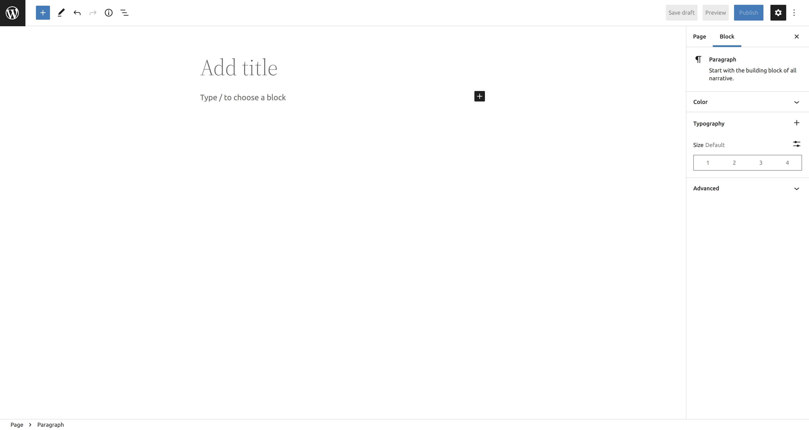
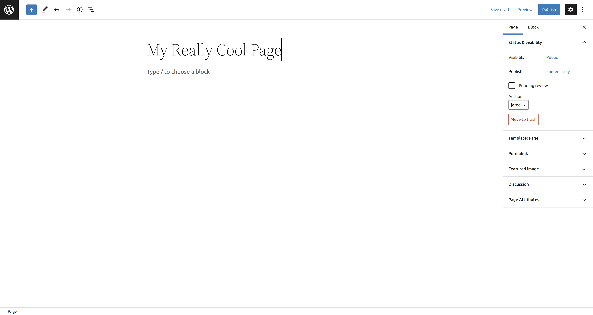
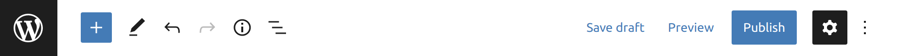
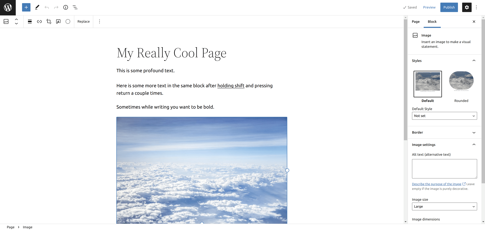
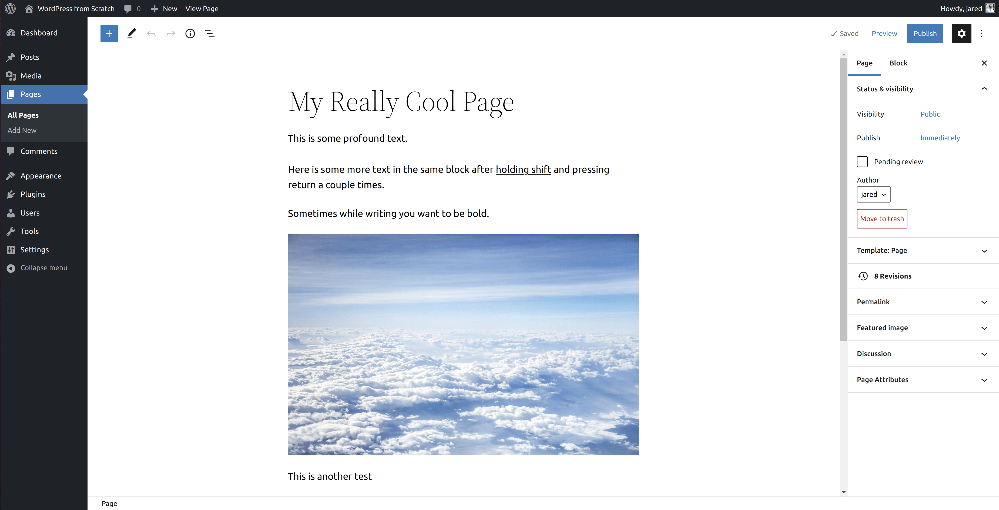
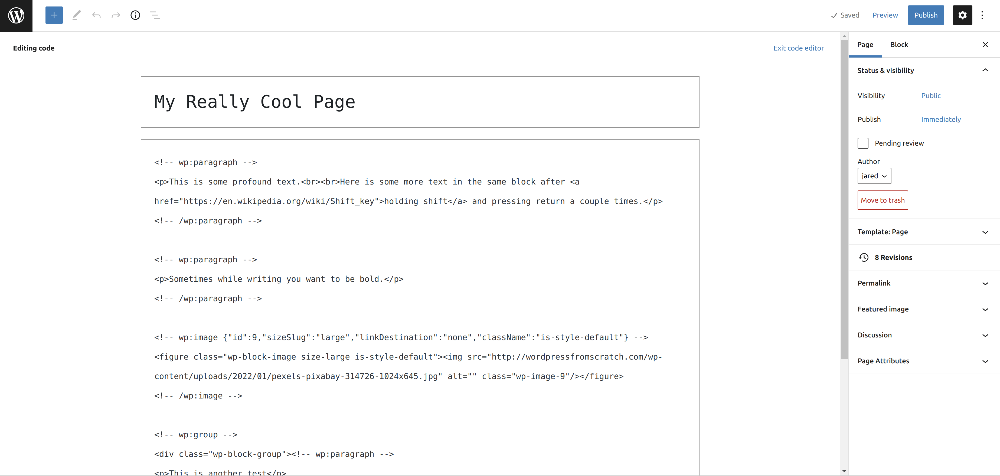
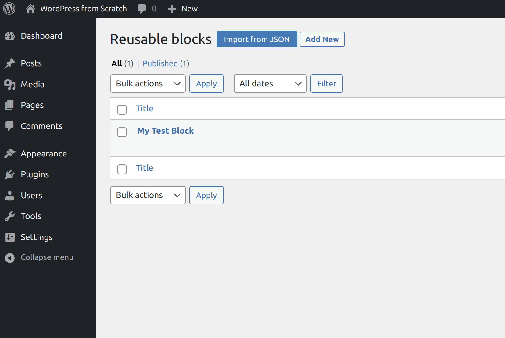
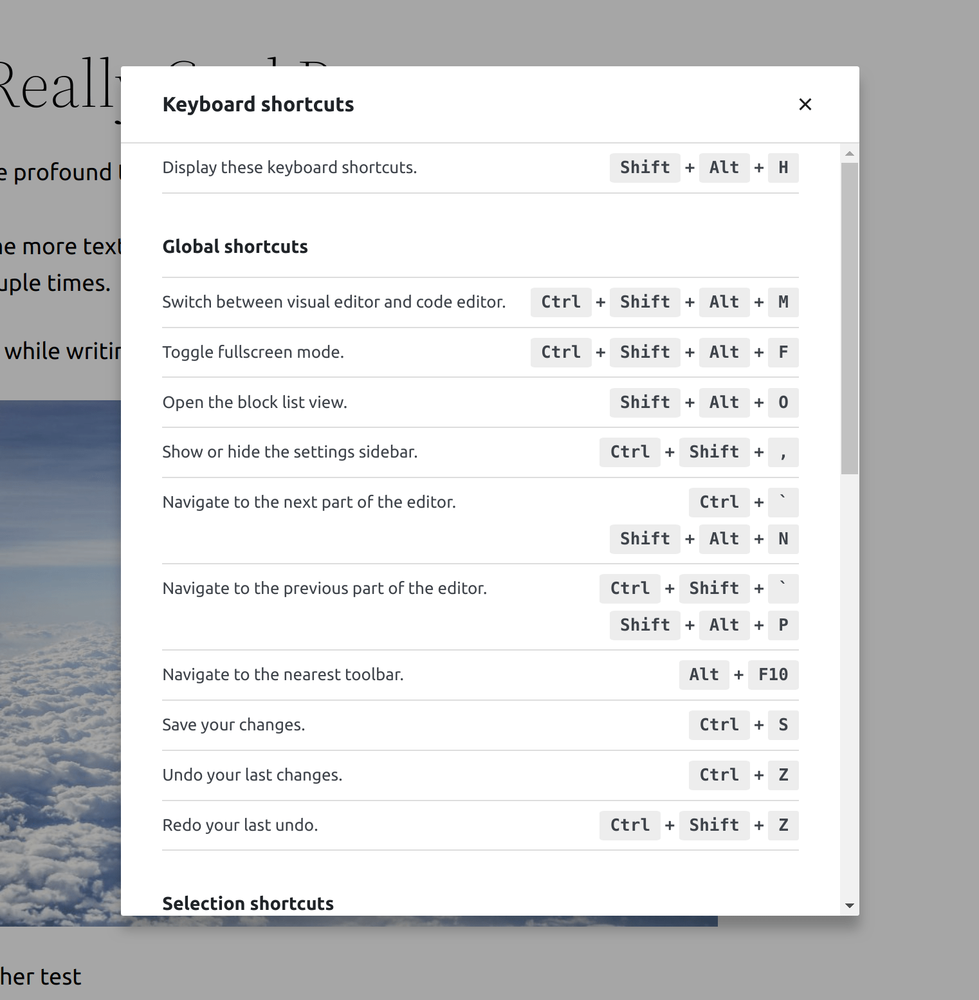

In this part of my _WordPress from Scratch_ series, I will be going over how to use the WordPress editor.

First, make sure you're logged in and you're on the _Pages_ page.  For this guide, we will be creating a page to practice with the editor.

To create a new page, click the _Add New_ button next to the _Pages_ title.

The first thing we will do is give the page a title.  I'm going to title my page, "My Really Cool Page."  That said, you can title your page whatever you like.  All you have to do is click _Add title_ and type in the page title you want.

To save this change, press CTRL+S or click the _Save draft_ button near the top-right of the screen.

## Editor Sidebar

Before we continue further, I want to take a moment to go over what's going on with the sidebar on the right and the bar at the top.



At the top of the sidebar, you will see that the _Page_ tab is currently selected.  This means that settings pertaining to the page you're editing is shown, as opposed to showing settings for the block that's selected.  We will be getting into what blocks are soon enough.

### Status & visibility


The two main settings to pay attention to is the _Visibility_ and _Publish_ settings.  You should see these settings by default as the _Status & visibility_ dropdown should be open.

### Template


The _Template_ dropdown shows which template WordPress is using to render this page.  By default, WordPress uses the _Page_ template.  Since _Page_ is the default template, it shows up as _Default template_ in the dropdown.

### Permalink


The permalink tab allows you to set the permalink for this page.  What is a permalink?  A permalink is the link that visitors use to access a page or post.  It's generally best practice to use the most concise permalink possible.

### Featured Image


The next dropdown is the _Featured Image_ dropdown.  Here, you can set the featured image for your page.  Some block themes will show the featured image for pages while others may not.  The featured image is primarily shown most for posts, where it is the prominent image displayed at the top of a post.

### Discussion


The next dropdown after _Featured Image_ is the _Discussion_ dropdown.  Here, you are able to set whether or not you want to allow comments to be posted on this page.

### Page Attributes


The final dropdown in the editor sidebar is the _Page Attributes_ dropdown.

You can use the _Parent Page_ dropdown to set a parent page relative to the page you're editing.  This is useful if you want to organize your pages into hierarchies.  Parent pages are known as _top-level_ pages, and child pages are descendants of that page.

The _Page Order_ setting allows you to change the order your pages are displayed while using a default menu.  For example, if you were to put 1 in the textbox, WordPress will display this page first.

## Editor Topbar
The next part of the editor we'll take a look at is the bar at the top.

The following is an explanation of what each button does from left to right.

### WordPress Logo Button
Want to exit the editor to the dashboard?  This is likely the quickest way to do so.  That being said, it doesn't save your work!  Be sure to save first if you intend to.  Your browser will likely warn you first if you haven't saved.

### + Button
The blue plus button opens the block inserter.  The block inserter shows all the different blocks you can add to your page.  Like I said, we will be diving into blocks soon enough.

### Tools Button
The next button is the _Tools_ button.  The Tools button allows you to select between _Edit_ and _Select_ modes.  Edit mode is the default mode when you open the editor.  It's the mode that allows you to edit block content.  Select mode is another way to select blocks and move them around.  You can also move blocks around in edit mode (my preferred method, personally).

### Undo Button
The _Undo_ button undos your latest change.

### Redo Button
The _Redo_ button redos your latest change.

### Details Button
The details button shows various cool statistics about your page or post.  The statistics shown include: characters, words, headings, paragraphs, and amount of blocks.

### List View Button
The _List View_ button allows you to view a list of the blocks on your post/page in the order they appear in.  You can also click and drag a block entry to another spot and the block will move in the editor view.

### Options Button
The _Options_ button is the button with the three dots in the top-right corner of the editor.  When you click on it, you will see the following options.



Here are the various options related to the editor:

#### View
These are options relating to the interface.  You can click any of these view-related options to toggle them.

##### Top Toolbar
The top toolbar option displays block options in a toolbar at the top of screen, rather than in a floating ribbon. 

##### Spotlight Mode
When _spotlight mode_ is enabled, blocks other than the block you selected are faded out.  Only the block that is selected is in focus.  This option can be great for a low distraction environment.

##### Fullscreen Mode
_Fullscreen mode_ is enabled by default when you first open the editor.  You can disable fullscreen mode to bring back the dashboard sidebar.

#### Editor

##### Visual Editor
The visual editor will display the normal block editing experience.

##### Code Editor
The code editor shows you the code behind your page or post.

#### Tools

##### Manage Reusable Blocks
The _Manage Reusable Blocks_ button redirects you to a dashboard screen where you can manage your reusable blocks.

##### Keyboard Shortcuts
You can view a list of keyboard shortcuts in the editor by clicking the _Keyboard Shortcuts_ button.

##### Welcome Guide
Clicking the _Welcome Guide_ button displays brief tutorial showing you the most important elements of the editor.


##### Copy All Content
_Copy All Content_ copies your post or page's code.  This is useful if you wanted to duplicate a page or post.

##### Help
The _Help_ button opens WordPress.org to an article about the [WordPress editor](https://wordpress.org/support/article/contributing-to-wordpress/).

#### Preferences
Clicking the preferences button in the options dropdown will open a window where you can select more preferences related to the editor.



## In Conclusion
In the next part, I will be covering the world of _blocks_.  Blocks are everything in WordPress, and I will be walking through everything about them in the [next part](https://learn.yorkcs.com/posts/2022/wordpress-from-scratch-8/).
