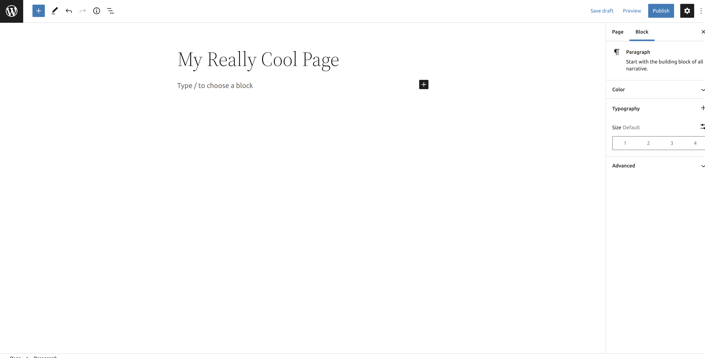
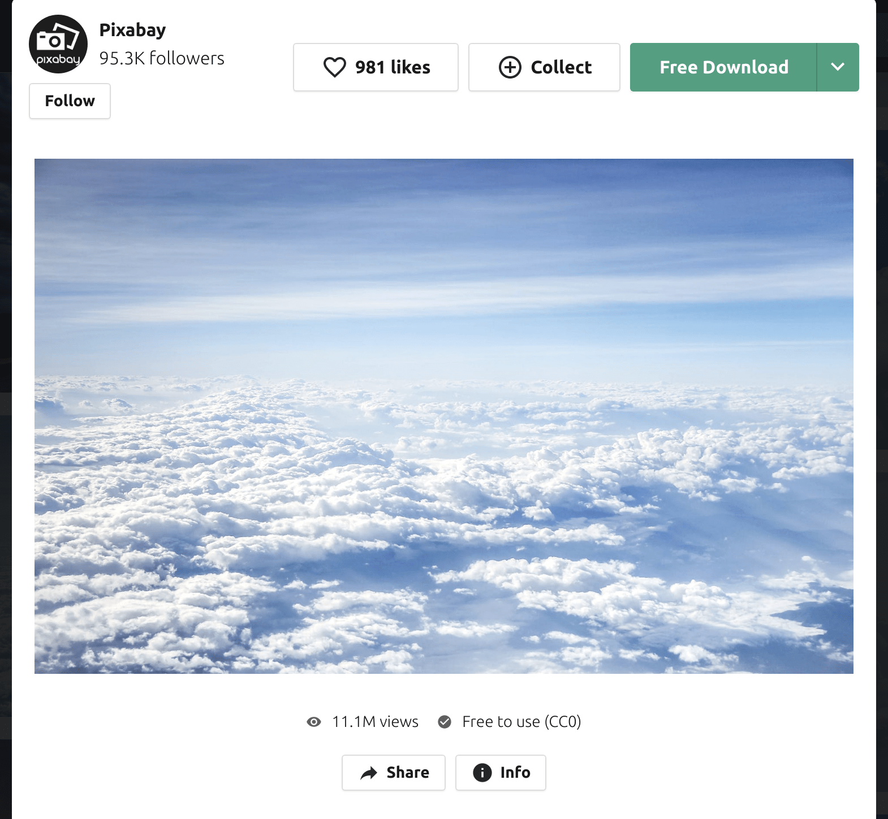
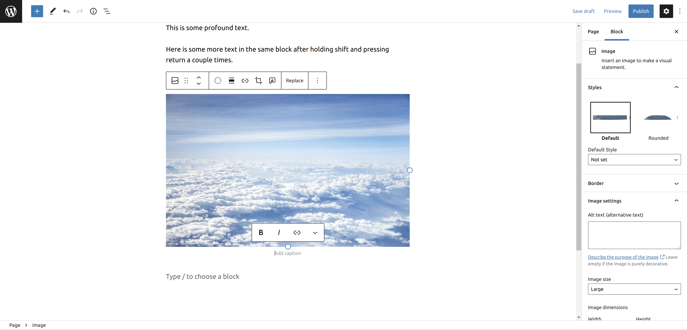
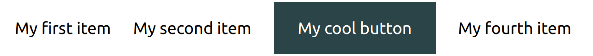
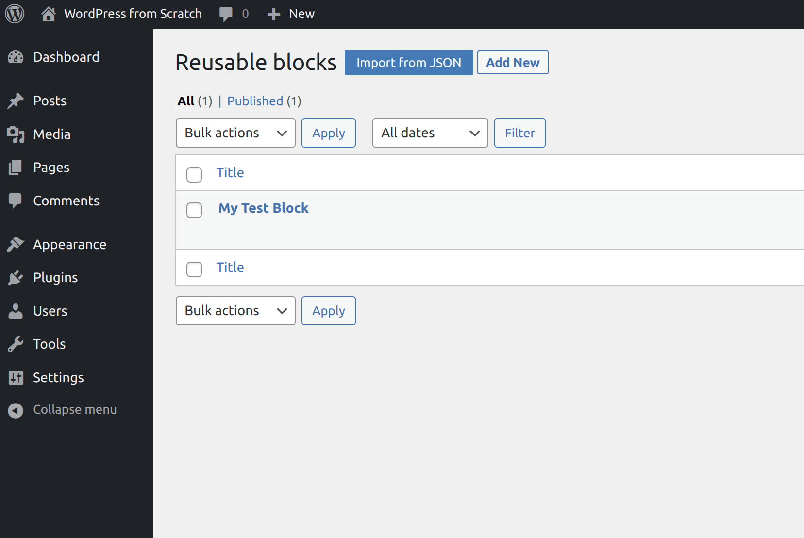
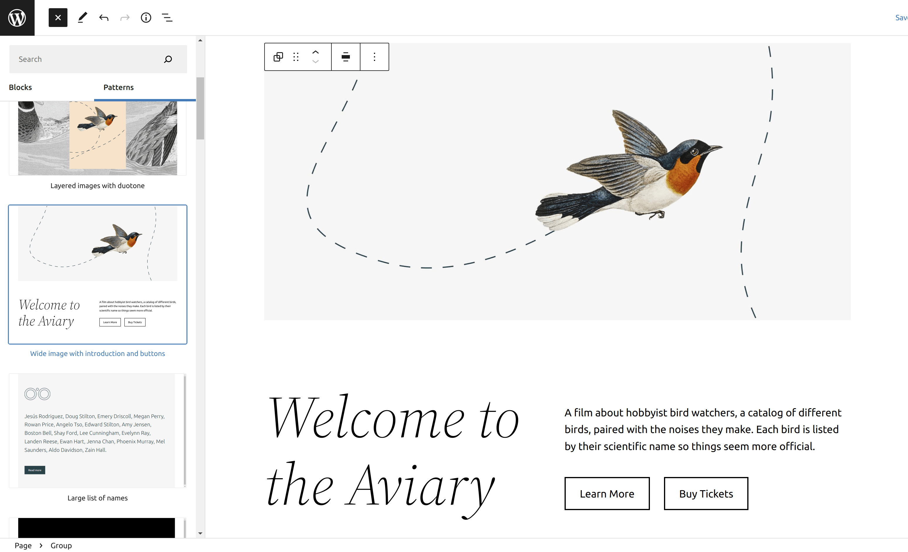

## What Is a Block?
You've heard me talk about blocks.  Now it's time to dig into them.  Blocks are the bread and butter of the WordPress editing experience.

_But what is a block?_
A block is simply an element that can be added to a page or post.  Text, images, columns, you name it, are all blocks.

### Block Themes
Blocks make up everything on a WordPress website that uses a block theme.  A _block theme_ is a WordPress theme that is built for the block editor.

In this series, we will be using the default theme of WordPress 5.9, Twenty-Twenty Two.  As of January 2022, there are a couple great places to find block themes.  You can find my guide to the best places to find block themes [here](https://learn.yorkcs.com/posts/2022/best-wordpress-block-theme-directories/).

## How Do You Use Blocks?
WordPress makes it easy to add, edit, and remove blocks.  Let's dive into the editor to and go through it.

If you came from the previous part of this series, you will already have a page you can practice with.  If not, please feel free to create a new page and follow along.

## The Paragraph Block

All you have to do to start adding text is to click where it says, _Type / to choose a block_ and start typing.  By doing so, WordPress automatically turned your text into a _paragraph_ block.  You can think of a paragraph block as a section of regular old text.  If you're writing a blog post, story, you name it, your content will be made up of lots of paragraph blocks.



If you want to just add a line break after some text, you can either press enter — OR — you can also hold the shift key and press enter to create new lines within the current paragraph block.  Take a look!



It's all about what you're looking to do.  WordPress empowers you edit content the way _you_ want.

## Adding Text Styles
Want to add various styles to a selection of text?  WordPress makes it easy to a make a selection of text bold, italic, strikethrough, etc.

The first step you need to do is select the text you want to apply a style to by highlighting it.



I'm going to make my selection of text bold, so I'm going to click the _B_ button in the ribbon.



Now the text I selected is bold!  Feel free to play around with the various text styles.  There are more styles and formatting options you can access by clicking the down arrow on the right side of the ribbon.



## Adding a Block



You may notice the black square button with a _+_ sign in it.  You can click this button and a dropdown will open where you can search for or select a commonly used block.  It's also worth noting that you can browse all blocks available by clicking the black _Browse all_ button at the bottom of the dropdown.  Clicking the _Browse all_ button will open what's known as the _block inserter_.



You can also press _/_ to view a list of the more common blocks which you can select and add (including an image).

### Adding an Image
Try adding another block, an image. Press enter at the end of the line you typed.





You will be prompted to either upload an image, select an image from the Media Library, or insert an image from a URL.



Now is a great time to go over how to upload an image.  Pexels is an amazing site to download free stock imagery.  Head over to [pexels.com](https://www.pexels.com/) and find an image you'd like to use.

Once you've found the image you want to use, click the green _Free Download_ button in the upper-right corner.  Your image will download.

The fun part (it is actually fun) is to add your image to your page.  Head back to the editor and click the blue _Upload_ button.  An _Open File_ dialog will open.  Navigate to where your image was downloaded (usually the _Downloads_ folder on most systems), select the image, then click _Open_.

When your image has finished uploading, your typing cursor will be moved to the caption area under the image.  Feel free to type a caption here if you like, then you can simply click off of it.  Of course you can select text in the caption just like above and bold or italicize it.  You can also make selected text a link as well by clicking the chain icon.

If you've read "WordPress from Scratch - 7: Editor Overview," you may know that I brushed over the _Block_ tab in the editor sidebar.  This is where it can come in to play.  For the image block, there are a bunch of different options you can apply.



Go ahead and play around with the options under the Block tab and see what they do.  The best way to learn what everything does is by experimenting!

## Creating a Link
Speaking of links, now is a great time to go over how you create one.  Find some text in your top paragraph block that you want to turn into a link and select it.



I'm going to select the text, "holding shift," and highlight it.  Now I'm going to find the URL for the Wikipedia article on the shift key (https://en.wikipedia.org/wiki/Shift_key), and click the link button on the ribbon.  A textbox will appear where you can paste (or type) in the URL.



Once you have the URL entered, you can press enter. You now have a working link!  It's a beautiful thing.



To edit a link, click on it, and a preview of the link will pop up.  You can click the pencil to edit the URL of the link.  It's also easy to make it so the link opens the URL in a new tab, just click the _Open in new tab_ toggle to enable that.


If you want to unlink the text, click the _Unlink_ button (the link button with the diagonal line through it).

## Moving Blocks
You will often find the need to move blocks around when working with them.  There are two ways to move a block.  First, select on the block you wish to move by clicking on it.  If you want to drag a block to a new location, you can click and drag the handle in the ribbon.



You can also click the up and down arrows on the ribbon to move the block up or down by one block.
 
## Organize Blocks with Groups, Columns, and Rows
There are three blocks that make it easier to organize blocks: _columns_, _group_, and _row_.

The columns block enables you to organize blocks in columns.  This block can be useful if you wanted to show, say, featured images such as services.

The group block allows you to keep blocks related to each other together.  You can of course move a group of blocks anywhere on the page/post. 

The row block lets you arrange blocks next to each other, horizontally.

## Reusable Blocks
_Reusable blocks_ are blocks that can be edited once, then displayed wherever the block is used.  Any changes made to a reusable block are also reflected where the block is used as well.

You can also make a whole section reusable by adding the related blocks to a group block.

To make a block reusable, click the button with the three dots in the tool ribbon above a selected block, then click the _Add to Reusable blocks_ option in the dropdown.



You will then be prompted to give the reusable block a name.



Click the blue _Save_ button once you've named your block.  Once you click save, you will receive a notice in the bottom-left corner, "Reusable block saved."

You will now also see the name of the reusable block when you select it.  It's pretty neat!



### Accessing Your Reusable Blocks
You can access your reusable blocks in the inserter by clicking the blue _+_ button in the top-left corner of the top bar.



You will notice a new tab in the inserter titled, "Reusable."  Click this tab and you will see all of the reusable blocks that you've created. 



You can also view a preview of a reusable block by moving your mouse over it.



### Managing Reusable Blocks
You can manage reusable blocks by clicking the _Manage Reusable blocks_ link.  You will be directed to the dashboard and be displayed a list of the reusable blocks you've added.

You can move your mouse over a reusable block in the list to view actions you can take regarding it.



If you're anything like me and like to keep everything tidy by permanently deleting reusable blocks in trash, I'll show you how.  First, access the trash for reusable blocks by clicking the _Trash_ link under the _Reusable blocks_ heading.  Then, you can either mark the blocks to remove and click the _Bulk actions_ dropdown, then click _Delete permanently_.  You can also hover over an individual reusable block and click the _Delete Permanently_ link.



## Block Patterns
A really cool thing about blocks is that you can add premade layouts onto your page.  These are called _block patterns_.  In fact, there is an entire library that WordPress makes available where you can add block patterns that others have already made to your website.  How cool is that?

You can also access the pattern library within WordPress itself.  You can either click the blue _+_ button in the top-left corner of the top bar, or you can click the black _+_ button you ordinarily would click to add a block.  To access the pattern library this way, you would click on _Browse All_.



Once the sidebar on the left opens, click the _Patterns_ tab.  You will then see all of the different blck patterns you can add to your page/post.  To add one of the patterns to your page, you just have to click on it.



The block pattern will then be instantly inserted into your post.  You can of course move it around or edit any of the blocks from there.

## In Conclusion
Hopefully this part has been helpful for you.  Blocks are incredibly powerful and you can do so many things with them.  In the next part of _WordPress from Scratch_, we're going to take a look at designing a homepage.  It's time to apply your new-found knowledge of blocks to the real world.

