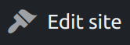

## The WordPress Site Editor
The WordPress site editor is quite similar, but also somewhat different than the editing experience for posts and pages.  While the editing experience works the same — both use blocks — the site editor is for editing _templates_.  I will cover templates in detail below.

## How to Start Editing
Like many things you can do with WordPress, there are multiple ways to perform a task.  There are a couple ways to open the site editor.

### Opening the Editor via the Dashboard
The first way to access the site editor is from the dashboard.  Take a look at the sidebar on the left, and you will see the _Appearance_ tab.  Move your mouse over this tab and you will see a dropdown open on the side.  In the dropdown, you will see the _Editor_ tab, click that.  The site editor will then open.



### Opening the Editor via the Homepage
You can also open the site editor by visiting the homepage, then click the _Edit Site_ button in the top bar.

## The Editor
Once the site editor is open, you may recognize the similarities to the editor for editing pages and posts.  The main difference is that you're editing a _template_.

## Templates
A primary feature of WordPress full site editing are templates.  You can think of a template as a layout for a "special" page on your website.  What are these special pages I'm talking about?

Here are some examples:
- Homepage
- 404 page
- Archive pages
- etc.

All of these are fully editable with WordPress.

### Changing the Template You're Editing
It's easy to change the template you're editing.  THere are two ways to do it.

#### Changing the Template via the Editor Sidebar
The first way to change the template you're editing is via the editor sidebar.  To open the sidebar, click the _W_ WordPress logo button in the top-left corner.

A sidebar will open on the left side of the editor.  You will see three tabs: _Site_, _Templates_, and _Template Parts_.



Click on the _Templates_ tab.  A list of the available templates will be displayed.  Since you have no additional plugins installed, you will just see a list of templates provided by the current theme (by default, _Twenty Twenty-Two_, as of 2022).

You can click the title of the template you wish to edit from there.

#### Changing the Template via the Template Details Button
You can also change the template you're editing via the arrow next to the template details in the middle of the top bar of the editor.  If you click the arrow, a dropdown will appear showing the details of the template you're editing.  You will also see the areas that the current template has.  

It's worth noting that you can click any of the areas listed to scroll down to that area.  It can be convenient to use this feature to, say, quickly scroll down to your footer if you have a long homepage.

You can also edit each of the areas by themselves, isolated from the rest of the page by clicking the _More options_ button, which is the button with the three vertical dots, displayed next to each area.



To change the template via this dropdown, click the black _Browse all templates_ button at the bottom of the dropdown.  You will then be directed to the _Templates_ tab of the editor sidebar.

From there, you can click the title of the template you wish to edit.

## Template Parts
A _template part_ is a special section within a template.  For example, the header and footer are both template parts.  Template parts can be added to any template.

It is worth mentioning that template parts can only be added to templates and _not_ any pages or posts.  Template parts are also restricted a single area in a template.

### Adding a Template Part to Template
To add a template part, make sure you're editing a template.  Then, just as you would a block, you can find or search for _Template Part_ just as you would a regular block.

### Viewing Template Parts
You can also view what added a template part, whether a theme, plugin, or a user added it.  I added a custom header previously so it shows up that I added it.

### Creating a Template Part
You can create a template part by clicking the blue _Add New_ button in the top-right corner.



From there, you can give the new template part a name, and select an area that it can be used in.  There are three areas: _General_, _Header_, and _Footer_.  Make sure _General_ is selected, then click the blue _Create_ button.

Once the editor has appeared, you will see a dark screen.  The reason why the screen is dark is so once you start adding blocks, you can tell the difference between what you're editing and the editor background.

You will need to first add a _group_ block via the blue _+_ button in the top-left.



The reason to add a group block is so multiple blocks can be added to this template part.

### When _Not_ to Use Template Parts
If you're looking to add a block that is shown globally, meaning the changes are reflected wherever the block is used, but want to add them to a page or post — create and use a reusable block.

## In Conclusion
Now that I gave you a general overview of the site editor, we are ready to design a homepage from scratch in the next part.  Don't worry, it's easier than it may sound.  Stay tuned for part 10 of _WordPress from Scratch_.

